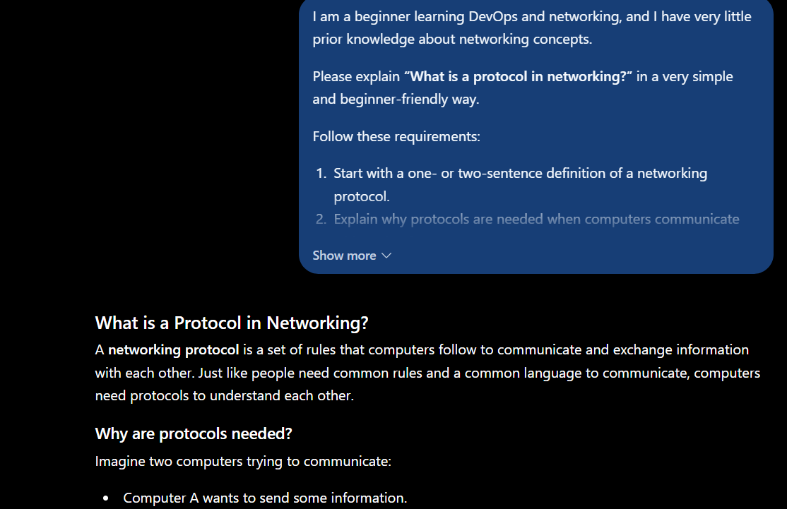
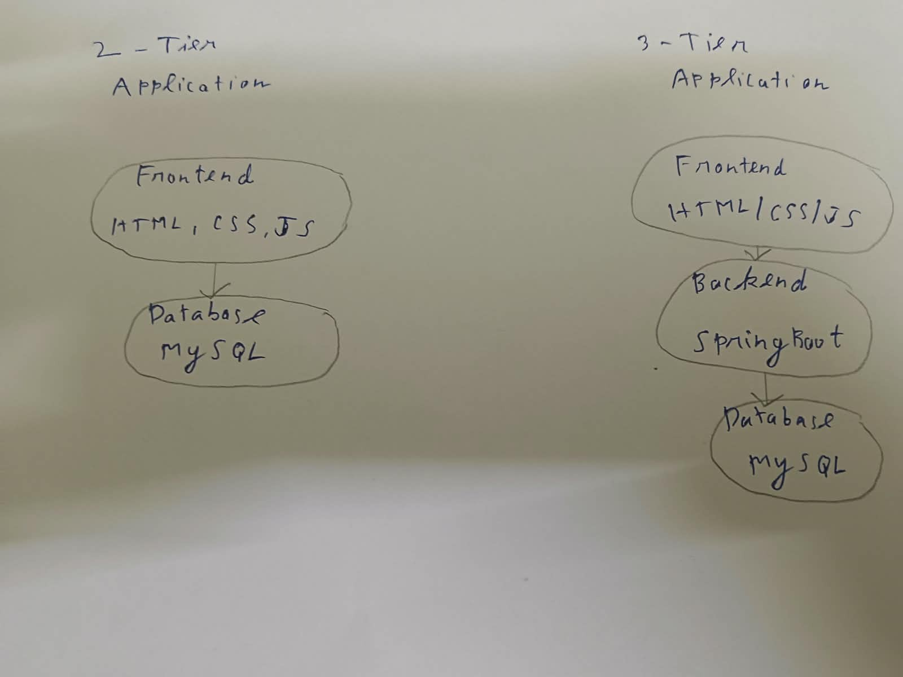
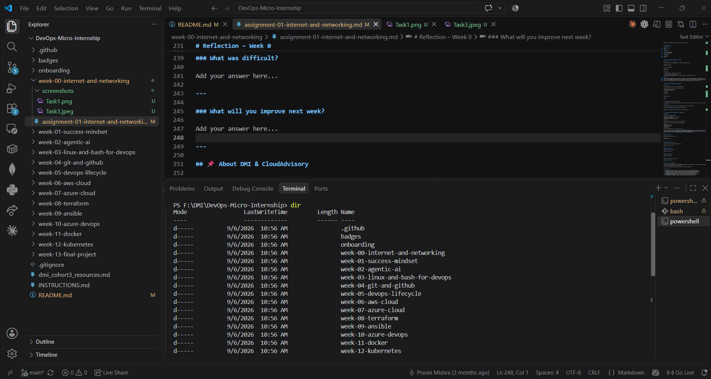

# Week 0 - Internet and Networking

Part of the DevOps Micro Internship (DMI) Campus with Agentic AI

---

# 🧑‍💻 Task 1: Using ChatGPT as Your Learning Assistant

## Scenario

You're new to DevOps and will frequently encounter technical questions. ChatGPT can be your learning companion.

## Your Task

Write a clear ChatGPT prompt to help you understand:

> "What is a protocol in networking? Explain with a simple real-life example."

Take a screenshot of your interaction showing:

* Your detailed prompt (with clear expectations)
* ChatGPT's simplified response with an example



## What I Learned (2–3 lines)

I learned how to write clear and detailed propmt by specifying my requirements, preferred explanation level, examples and expected format.

---

# 🌐 Task 2: Internet and Networking

## Scenario

Your friend is launching an online bookstore named **EpicReads**.

He asked you to explain how users globally can access his website hosted in Finland.

## Your Task

Write a short explanation (**100–150 words**) that includes:

* Packet Switching
* IP Address
* TCP/IP
* HTTP/HTTPS

💡 **Tip:** You may use ChatGPT (as demonstrated in Task 1) to refine your explanation.

## Answer

When an overseas user attempts to access the online bookstore epicreads.com in Finland, multiple networking concepts come together to make the website appear on the screen. Firstly, packet switching splits the data into packets that are sent through different routes in the transmission system and then reassembled. Each end point that is connected to the internet has a unique IP address, as used in the communication between the user’s machine and the web server.


The Transmission Control Protocol/Internet Protocol (TCP/IP) is a standard suite of communication protocols that enable internet connections. It is comprised of the Internet Protocol (IP) which is responsible for assigning the addresses and routing the data packets and the Transmission Control Protocol (TCP). TCP is the set of rules used in the TCP/IP model that ensures reliable data delivery.


Moreover, Hyper Text Transfer Protocol (HTTP) and Hyper Text Transfer Protocol Secure (HTTPS) are used to communicate between web browsers and servers. HTTP is used for transmitting data between websites and web servers, whereas HTTPS is a secure version of HTTP that uses encryption to protect sensitive data such as passwords and credit card information during online transactions.

---

# 🏗️ Task 3: Application Architecture & Stack

## Scenario

EpicReads bookstore has two application versions:

### Two-Tier Application

* Frontend
* Database

### Three-Tier Application

* Frontend
* Backend
* Database

## Your Task

* Draw simple diagrams (hand-drawn or tool-based such as draw.io)
* Label each layer clearly
* List at least two common technologies or tools used for each layer
* Submit a screenshot or photo clearly showing your own drawing

## Diagram Screenshot / Photo

Save your diagram image in the `screenshots` folder and update the file name below.




Replace `task-3-diagram.png` with your actual diagram file name.

---

## Technologies Used

### Frontend

* HTML, CSS, JS
* React

### Backend

* Java with SpringBoot
* Node.js with Express

### Database

* PostgreSQL
* MySQL

---

# 🌍 Task 4: Domain Name & DNS (Basic Concepts)

## Scenario

Your friend's bookstore **EpicReads** is currently accessible through:

```text
52.172.142.222:3000
```

He purchased the domain:

```text
epicreads.com
```

## Your Task

In **50–100 words**, explain in your own words:

1. What is DNS (Domain Name System)?
2. Which DNS record type should be used to connect the domain to the given IP, and why?

## Answer

DNS (Domain Name System) serves as an Internet's phone book. It translates domain names, like epicreads.com, into IP addresses that are used by computers to identify servers on the Web. In order to direct epicreads.com to the given IP address 52.172.142.222, an A record should be used because an A record maps the domain name to the IPv4 address. Therefore, when a user types in epicreads.com, a DNS lookup will be able to route them to the EpicReads server at 52.172.142.222.

---

# 💻 Task 5: Visual Studio Code Setup (Hands-on)

## Your Task

Install Visual Studio Code (if not already installed).

Take a screenshot of your VS Code environment showing:

* Terminal open inside VS Code
* Running a basic command:

### Windows

```powershell
dir
```

### Linux / macOS

```bash
pwd
ls
```

* Your selected VS Code theme clearly visible

⚠️ **Important:** The screenshot must show your username or another identifiable detail to confirm it is your environment.

## Screenshot



---

# 🔗 Task 6: Publish Your Assignment as a LinkedIn Post

## Objective

Publishing on LinkedIn helps you:

* Build your professional online presence
* Reinforce your learning
* Document your DevOps journey publicly

## Your Task

Summarize your answers from Tasks 1–5 into a LinkedIn post.

Clearly structure your post into the following sections:

* ChatGPT
* Internet & Networking
* App Architecture
* DNS
* VS Code Setup

Add the following credit note at the end of your post:

P.S. This post is part of the DevOps Micro Internship (DMI) — Campus — by Pravin Mishra. My graded progress is public: https://dmi.pravinmishra.com/s/Nihelesh.html · Start your DevOps journey: https://dmi.pravinmishra.com/?utm_source=student&utm_medium=ps-linkedin&utm_campaign=campus

---

## LinkedIn Post URL

Paste your LinkedIn post URL here:

```text
Add your URL here...
```

---

## LinkedIn Post Backup Copy

🚀 DevOps Micro Internship (DMI) With Agentic AI — Cohort #3 — Week 0 [Getting Started]


I am thrilled to begin my DevOps Micro Internship (DMI) with Agentic AI — Cohort #3, and I am looking forward to learning fundamentals about Internet, networking, application architecture, and development environment setup this week!


🤖 ChatGPT


I learned how to frame my request to ChatGPT to get the desired information. I learned that it is important to give a clear description of my request, specify what types of explanation/ examples are needed, and what format the response should be provided in.


🌐 Internet & Networking


I learned about packet switching, IP Addresses, TCP/IP, and HTTP/HTTPS (Hyper Text Transfer Protocol Secure). I learned that data is packet-switched over the internet using IP (Internet Protocol) addresses which can be IPv4 or IPv6. The data packets are broken down using the TCP (Transmission Control Protocol) and the packets are reassembled at their destination using IP addresses. The packets are then passed from one browser to the web server using HTTP/HTTPS (the secure version of HTTP). I learned that web browsers and web servers communicate over the HTTP/HTTPS protocol where Hypertext Markup Language (HTML) is transferred.


🏗️ App Architecture


I learned about two-tier and three-tier application architecture. The two-tier application connects directly to the database while the three-tier application connects through the front-end and back-end. The three-tier application is also easier to maintain and manage


🌍 DNS


I learned about Domain Name System (DNS) and how domain names resolve to IP Addresses. For Example, the A record epicreads.com resolves to an IPv4 address 52.172.142.222.


💻 VS Code Setup


I learned how to set up the development environment (VS Code).


This week provided me with a basic knowledge of how the application connects with the Internet and how they are set up. I look forward to learning more and enhancing my DevOps skills. 🚀


P.S. This post is part of the DevOps Micro Internship (DMI) with Agentic AI — Cohort #3 — by Pravin Mishra. My graded progress is public: https://dmi.pravinmishra.com/s/YOUR-GITHUB-USERNAME.html · Start your DevOps journey: https://dmi.pravinmishra.com/?utm_source=student&utm_medium=ps-

---

# Reflection – Week 0

### What did you find easy?

I found it easy to understand the basic concepts of networking, DNS, and application architecture. Using simple real-life examples and ChatGPT's explanations helped me understand these concepts more clearly.

---

### What was difficult?

The most difficult part was understanding how different networking concepts work together, especially packet switching, TCP/IP, HTTP/HTTPS, and DNS. Connecting these individual concepts to a real-world application required some additional thinking.

---

### What will you improve next week?

Next week, I will focus on understanding DevOps concepts more deeply and gaining more hands-on experience. I will also improve my ability to use technical tools and document my learning clearly.

---

## 📌 About DMI & CloudAdvisory

DevOps Micro Internship (DMI) is a project-based DevOps program run by Pravin Mishra (The CloudAdvisory) focused on real-world execution, systems thinking, and career readiness.

It helps learners build strong DevOps foundations with hands-on experience.


## 📌 Resources

- 🌐 **DMI Official Website:** https://dmi.pravinmishra.com?utm_source=github&utm_medium=readme  
- 🎓 **University:** https://university.pravinmishra.com?utm_source=github&utm_medium=readme  
- 💬 **Discord Community:** https://discord.pravinmishra.com?utm_source=github&utm_medium=readme  
- 📝 **Blog:** https://dmi.pravinmishra.com/blog?utm_source=github&utm_medium=readme  
- ▶️ **YouTube Playlist (DMI Cohort 3):** https://www.youtube.com/playlist?list=PLFeSNDtI4Cho  
- 🔗 **Pravin Mishra (LinkedIn):** https://www.linkedin.com/in/pravin-mishra-aws-trainer/  
- 🏢 **CloudAdvisory (LinkedIn):** https://www.linkedin.com/company/thecloudadvisory/

---

*This submission is part of DevOps Micro Internship (DMI) Cohort 3 — Agentic AI Track*